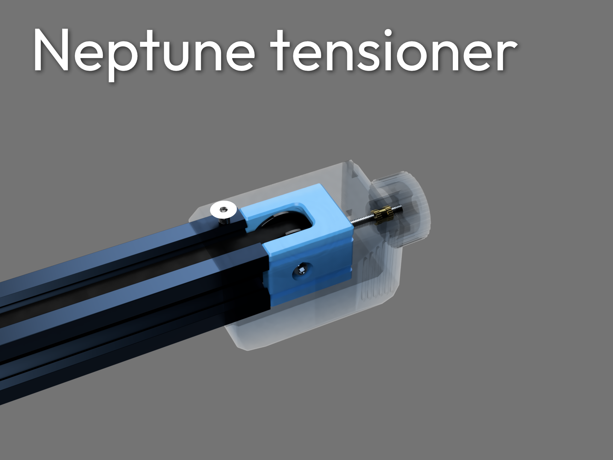

Shield: [![CC BY-NC-SA 4.0][cc-by-nc-sa-shield]][cc-by-nc-sa]

This work is licensed under a
[Creative Commons Attribution-NonCommercial-ShareAlike 4.0 International License][cc-by-nc-sa].

[![CC BY-NC-SA 4.0][cc-by-nc-sa-image]][cc-by-nc-sa]

[cc-by-nc-sa]: http://creativecommons.org/licenses/by-nc-sa/4.0/
[cc-by-nc-sa-image]: https://licensebuttons.net/l/by-nc-sa/4.0/88x31.png
[cc-by-nc-sa-shield]: https://img.shields.io/badge/License-CC%20BY--NC--SA%204.0-lightgrey.svg

Want a better backup for your tensioner in case it breaks?

Too tired of belt rubbing on the ends of extrusions?

Still not tense enough at the end of the movement range?

Or just simply needing an upgrade

This tensioner does it all, being carefully designed to shove as much material into the part, enhancing strenth, it aligns better with the rails on the stock cover, have more tension range, and it uses a proper toothed idler!

🤩 Do you like the design?

[Consider supporting me!](https://buymeacoffee.com/silencedfrost) It immensely help me design more models like this!

Submit feature requests [here!](https://trello.com/b/vacGVoLQ/cad-modelling-requests)

Features:
- Reduces belt rubbing
- Remove potential print artifacts
- Automatically align better
- More adjustment range
- Built sturdier than stock
- Suitable for the neptune 3 and 4 lineup

NOTE:
Put the belt over the idler before putting it in

Recommended print settings:
- Walls/perimeters: atleast 2.4mm
- Tolerance requirement: 0.2mm
- Print orientation: as imported
- Supports: none

Recommended materials:
 - PETG
 - ABS/ASA
 - Any low-creep plastic

Installation requires:
 - 1 * M3 x 25mm BHCS
 - 1 * M3 x 8mm BHCS
 - 1 * M3 x 12mm binding screw
 - 1 * 4 x 18 x 8.5 GT2 idler (check image)

Installation guide:

